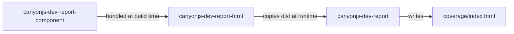

# canyonjs-dev-istanbul-report-html

A pnpm monorepo for Istanbul HTML coverage reports. With the UI package installed, it outputs a single-file HTML report with embedded coverage data.

## Packages

| Directory | npm package | Description |
|-----------|-------------|-------------|
| `packages/report-component` | `canyonjs-dev-report-component` | React component library; build output is bundled into report-html |
| `packages/report-html` | `canyonjs-dev-report-html` | Single-file HTML UI (Vite + React); publishes `dist/` |
| `packages/report` | `canyonjs-dev-report` | Istanbul reporter; optionally writes a single-file HTML report |

## Architecture



**Data flow:**

1. A test framework (e.g. Vitest) collects Istanbul coverage
2. If `canyonjs-dev-report-html` is installed, `canyonjs-dev-report` reads the HTML template, injects data, and writes `coverage/index.html`
3. Open `coverage/index.html` in a browser to view the report (single file, no extra assets)

For JSON-only output, use Istanbul's built-in `"json"` reporter; it is independent of this reporter.

## Quick start

### Requirements

- Node.js 22+
- pnpm 10.33+

### Install and build

```bash
pnpm install
pnpm build
```

Build order: `report-component` → `report-html` → `report`

### Local UI development

```bash
pnpm dev:report-html
```

## Usage in a project

### Vitest + Istanbul

```ts
// vitest.config.ts
import path from "node:path";
import { defineConfig } from "vitest/config";

export default defineConfig({
  test: {
    coverage: {
      provider: "istanbul",
      reporter: [
        "json",
        [
          path.resolve(__dirname, "./node_modules/canyonjs-dev-report/dist/index.cjs"),
          { verbose: true },
        ],
      ],
    },
  },
});
```

Install:

```bash
npm install -D canyonjs-dev-report
# Optional: auto-generate the HTML report
npm install -D canyonjs-dev-report-html
```

After running tests, if `canyonjs-dev-report-html` is installed, the coverage directory contains:

```
coverage/
└── index.html          # Single-file HTML report (embeds window.reportData)
```

### With istanbul-lib-report

```ts
import libCoverage from "istanbul-lib-coverage";
import libReport from "istanbul-lib-report";
import HtmlReport from "canyonjs-dev-report";

const coverageMap = libCoverage.createCoverageMap(/* ... */);
const context = libReport.createContext({
  dir: "coverage",
  coverageMap,
});

libReport.create(HtmlReport, {}).execute(context);
```

## Versioning

All packages share a single version via [bumpp](https://github.com/antfu/bumpp) (e.g. all at `1.0.0`, `1.0.1`).

```bash
pnpm release          # Interactive patch / minor / major
pnpm release:patch    # 1.0.0 → 1.0.1
pnpm release:minor    # 1.0.0 → 1.1.0
pnpm release:major    # 1.0.0 → 2.0.0
```

bumpp updates all 4 `package.json` files, runs `pnpm install`, and creates a git commit and tag (e.g. `v1.0.1`).

Pushing the tag triggers CI to publish:

```bash
git push && git push --tags
```

## Publishing to npm

### CI auto-publish

1. Configure `NPM_TOKEN` in GitHub Secrets
2. Run `pnpm release` and push the tag
3. `.github/workflows/publish.yml` publishes the three packages in order

### Local manual publish

```bash
pnpm build
pnpm publish:packages
```

On publish, `workspace:*` is replaced with exact versions—for example, `canyonjs-dev-report`'s `optionalDependencies` becomes `"canyonjs-dev-report-html": "1.0.0"`.

## Project structure

```
.
├── packages/
│   ├── report-component/   # React component library (tsdown)
│   ├── report-html/        # HTML UI (Vite + vite-plugin-singlefile)
│   └── report/             # Istanbul reporter (tsdown, CommonJS)
├── bump.config.ts            # Unified version bump config (filename is bump, not bumpp)
├── pnpm-workspace.yaml
└── .github/workflows/publish.yml
```

## Common commands

| Command | Description |
|---------|-------------|
| `pnpm build` | Build all packages |
| `pnpm build:report-html` | Build HTML UI only |
| `pnpm build:report` | Build reporter only |
| `pnpm dev:report-html` | Start report-html dev server |
| `pnpm --filter canyonjs-dev-report test` | Run report package tests |
| `pnpm release:patch` | Bump all packages by patch |

## License

[MIT](./LICENSE) © [Travis Zhang](https://github.com/travzhang)
