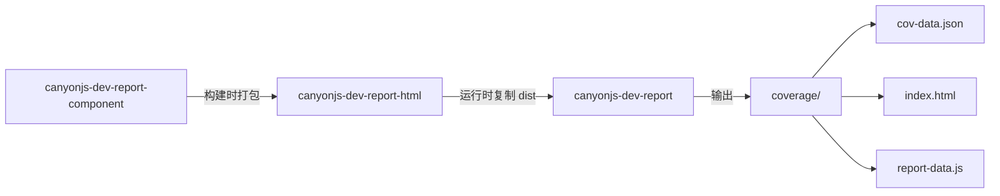

# canyonjs-dev-istanbul-report-html

基于 Istanbul 的 HTML 覆盖率报告 monorepo。将覆盖率数据生成为 JSON，并在安装 UI 包后输出可交互的 HTML 报告。

## 包一览

| 目录 | npm 包名 | 说明 |
|------|----------|------|
| `packages/report-component` | `canyonjs-dev-report-component` | React 组件库，构建产物供 report-html 打包 |
| `packages/report-html` | `canyonjs-dev-report-html` | 单文件 HTML UI（Vite + React），发布 `dist/` |
| `packages/report` | `canyonjs-dev-report` | Istanbul 报告器，生成 JSON 并可选输出 HTML |

## 架构



**数据流：**

1. 测试框架（如 Vitest）收集 Istanbul 覆盖率
2. `canyonjs-dev-report` 作为 reporter 写入 `cov-data.json`
3. 若安装了 `canyonjs-dev-report-html`，同时复制 `index.html` 并生成 `report-data.js`
4. 浏览器打开 `coverage/index.html` 查看报告

## 快速开始

### 环境要求

- Node.js 22+
- pnpm 10.33+

### 安装与构建

```bash
pnpm install
pnpm build
```

构建顺序：`report-component` → `report-html` → `report`

### 本地开发 UI

```bash
pnpm dev:report-html
```

## 在项目中使用

### Vitest + Istanbul

```ts
// vitest.config.ts
import path from "node:path";
import { defineConfig } from "vitest/config";

export default defineConfig({
  test: {
    coverage: {
      provider: "istanbul",
      reporter: [
        "json",
        [
          path.resolve(__dirname, "./node_modules/canyonjs-dev-report/dist/index.cjs"),
          { verbose: true },
        ],
      ],
    },
  },
});
```

安装：

```bash
npm install -D canyonjs-dev-report
# 可选：自动生成 HTML 报告
npm install -D canyonjs-dev-report-html
```

运行测试后，覆盖率目录默认包含：

```
coverage/
├── cov-data.json       # 覆盖率 JSON 数据
├── index.html          # HTML 报告（需安装 report-html）
└── report-data.js      # 注入 window.reportData
```

### 与 istanbul-lib-report 配合

```ts
import libCoverage from "istanbul-lib-coverage";
import libReport from "istanbul-lib-report";
import HtmlReport from "canyonjs-dev-report";

const coverageMap = libCoverage.createCoverageMap(/* ... */);
const context = libReport.createContext({
  dir: "coverage",
  coverageMap,
});

libReport.create(HtmlReport, {}).execute(context);
```

## 版本管理

所有包通过 [bumpp](https://github.com/antfu/bumpp) 统一版本号（如全部为 `1.0.0`、`1.0.1`）。

```bash
pnpm release          # 交互式选择 patch / minor / major
pnpm release:patch    # 1.0.0 → 1.0.1
pnpm release:minor    # 1.0.0 → 1.1.0
pnpm release:major    # 1.0.0 → 2.0.0
```

bumpp 会同步更新 4 个 `package.json`、运行 `pnpm install`、创建 git commit 和 tag（如 `v1.0.1`）。

推送 tag 后触发 CI 自动发布：

```bash
git push && git push --tags
```

## 发布到 npm

### CI 自动发布

1. 在 GitHub Secrets 配置 `NPM_TOKEN`
2. 运行 `pnpm release` 并推送 tag
3. `.github/workflows/publish.yml` 按顺序发布三个包

### 本地手动发布

```bash
pnpm build
pnpm publish:packages
```

发布时 `workspace:*` 会转换为精确版本号，例如 `canyonjs-dev-report` 的 `optionalDependencies` 会锁定为 `"canyonjs-dev-report-html": "1.0.0"`。

## 项目结构

```
.
├── packages/
│   ├── report-component/   # React 组件库 (tsdown)
│   ├── report-html/        # HTML UI (Vite + vite-plugin-singlefile)
│   └── report/             # Istanbul reporter (tsdown, CommonJS)
├── bump.config.ts            # 统一版本 bump 配置（注意文件名是 bump 不是 bumpp）
├── pnpm-workspace.yaml
└── .github/workflows/publish.yml
```

## 常用命令

| 命令 | 说明 |
|------|------|
| `pnpm build` | 构建全部包 |
| `pnpm build:report-html` | 仅构建 HTML UI |
| `pnpm build:report` | 仅构建 reporter |
| `pnpm dev:report-html` | 启动 report-html 开发服务器 |
| `pnpm --filter canyonjs-dev-report test` | 运行 report 包测试 |
| `pnpm release:patch` | 统一 bump patch 版本 |

## License

ISC
